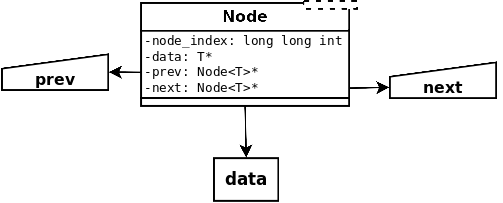
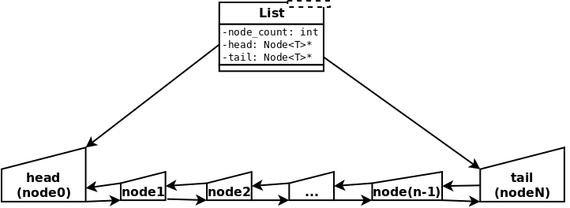

<p style="color: #ff7e00; font-size: 1.8em;"><strong>Linked List</strong></p>

A rather verbose template for a linked list in C++

Included generic class templates:

* Node\<T\>
* List\<T\>


<h2 style="color: ff7e00;">Structure</h2>

<h4 style="color: #ff0000;"><em>Node</em></h4>

Generic type and bidirectional, allowing traversal from tail to head




<h4 style="color: #ff0000;"><em>List</em></h4>

Maintains references to both head and tail node(s)




<h2 style="color: ff7e00;">Functionality</h2>

<h6 style="color: #ff0000;"><em>Permitted data types:</em></h6>

```
* Boolean
* integer
* floating-point
* character
* C++ string (*NOT* C style NULL-terminated strings!)
```

_Dynamically-allocated variables within these objects must be handled manually or template functions
overridden to do so:_

```
* class
* struct
* union
```

 Please note that it is _**not**_ a good idea to use unions or structs this way: The absence of a destructor
 means that within these objects, _**any pointer to a variable allocated with the "new" keyword will not
 be freed by the list**_

<h6 style="color: #ff0000;"><em>Incompatible data types:</em></h6>

```
* array
* NULL pointer
* STL data structure
* anything else referred to via pointer
```

<h6 style="color: #ff0000;"><em>Operations:</em></h6>

```
* copy constructor
* add, append, and delete node functions
* find node by provided index
* find node by matching provided data
* print list to terminal
```


<h2 style="color: ff7e00;">Build Tools</h2>

* [CLion](https://www.jetbrains.com/clion/documentation/) -  IDE by Jetbrains v2018.1.6
* [CMake](https://cmake.org/documentation/) - C/C++ build manager v3.10.3
* [GDB](https://www.gnu.org/software/gdb/documentation/) - GNU Project Debugger v8.1
* [GCC](https://gcc.gnu.org/onlinedocs/) - GNU C/C++ compiler v8.2.0


<h2 style="color: ff7e00;">Visual Documentation</h2>

Images crafted with the finest tools and the utmost precision using **[Dia](http://dia-installer.de/index.html.en)**
diagram creator and [GIMP](https://www.gimp.org/) to add transparency:

 Type | <h6 style="color: #ffffff;">White background</h6> | <h6 style="color: #000000;">No background</h6> | <h6 style="color: #ff0000;">Dia files</h6>
 ---: | :---: | :---: | :---:
 Node | [White](img/node_layout_white.png) | [None](img/node_layout_transp.png) | [.dia file](img/node_layout.dia)
 List | [White](img/list_layout_white.png) | [None](img/list_layout_transp.png) | [.dia file](img/list_layout.dia)


<h2 style="color: ff7e00;">Authors</h2>

[Chris Mabon](https://github.com/chrismabon) - *Contributor*


<h2 style="color: ff7e00;">License</h2>

This project is licensed under the GNU General Public License v3.0 (GNU GPLv3)
See [LICENSE](LICENSE.md) for details