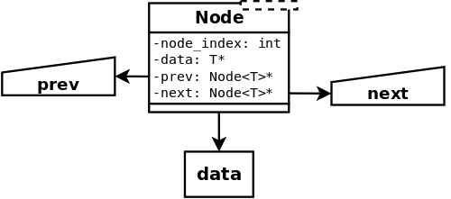

<p style="color: #ff7e00; font-size: 1.8em; text-align: center;"><strong>Linked List</strong></p>

A rather verbose template for a linked list in C++

Included generic class templates:

* Node\<T\>
* List\<T\>


<h2 style="color: ff7e00; margin: 0 0 30px 0;">Structure</h2>


<h4 style="color: #ff0000; text-align: left; margin: 0 0 0 100px;"><em>Node</em></h4>

```
Generic type and bidirectional, allowing traversal from tail to head
```



<h2 style="color: ff7e00; margin: 0 0 30px 0;"> </h2>

<h4 style="color: #ff0000; text-align: left; margin: 0 0 0 100px;"><em>List</em></h4>

```
Maintains references to both head and tail nodes
```


<h2 style="color: ff7e00;">Functionality</h2>

<h6 style="color: #ff0000; text-align: left; margin: 0 0 0 100px;"><em>Permitted data types</em></h6>

```
* Boolean
* integer
* floating-point
* character
* C++ string (NOT a C style NULL-terminated string)
```

 Please note that certain data types and structures are not permitted: The absence of a destructor for
 them means that within these objects, _**any pointer to a variable allocated with the "new" keyword will
 not be freed by the list**_

<h6 style="color: #ff0000; text-align: left; margin: 0 0 0 100px;"><em>Incompatible data types</em></h6>

```
* class
* struct
* union
* array
* NULL pointer
* STL data structure
* anything else referred to via pointer
```

You may subclass the list and overload its member functions such that any otherwise-incompatible types
can be destructed properly, etc.

<h6 style="color: #ff0000; text-align: left; margin: 0 0 0 100px;"><em>Operations</em></h6>

```
* add, append, and delete node functions
* find node by provided index
* find node by matching provided data
* print list to terminal
* generate nodes with randomized values
* generate lists of any size with randomized nodes
```


<h2 style="color: ff7e00;">Tools</h2>

* [CLion](https://www.jetbrains.com/clion/documentation/) -  IDE by Jetbrains v2018.1.6
* [CMake](https://cmake.org/documentation/) - C/C++ build manager v3.10.3
* [GDB](https://www.gnu.org/software/gdb/documentation/) - GNU Project Debugger v8.1
* [GCC](https://gcc.gnu.org/onlinedocs/) - GNU C/C++ compiler v8.2.0
* [GIMP](https://www.gimp.org/) - GNU Image Manipulation Program v2.10.8
* [Dia](http://dia-installer.de/index.html.en) - Structured diagram editor v0.97

<h2 style="color: ff7e00;">Visual Documentation</h2>

 Type | <h6 style="color: #ffffff;">White background</h6> | <h6 style="color: #000000;">No background</h6> | <h6 style="color: #ff0000;">Dia files</h6>
 :---: | :---: | :---: | :---:
 Node | [White](img/node_layout_white.png) | [None](img/node_layout_transp.png) | [.dia file](img/node_layout.dia)
 List | [White](img/list_layout_white.png) | [None](img/list_layout_transp.png) | [.dia file](img/list_layout.dia)


<h2 style="color: ff7e00;">Contribution</h2>

* [Chris Mabon](https://github.com/chrismabon)


<h2 style="color: ff7e00;">License and Copyright</h2>

This project is [licensed](LICENSE.md) under the GNU General Public License v3.0 (GNU GPLv3)

[Copyright](COPYRIGHT.md) (C) 2019 Chris Mabon
